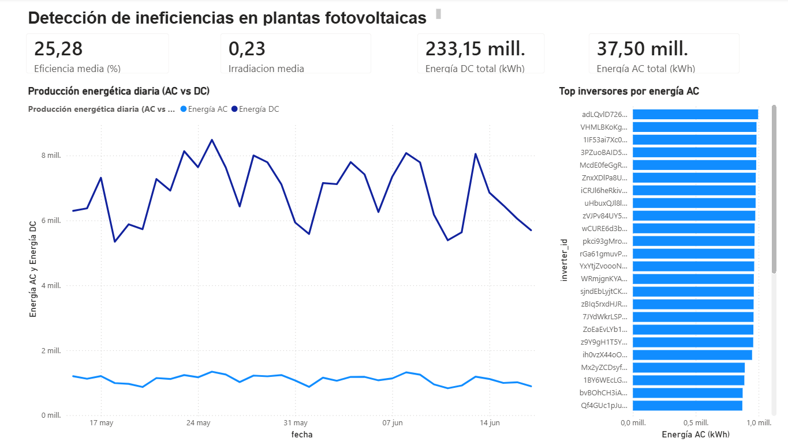

# Detección de ineficiencias en plantas fotovoltaicas

## Objetivo

Análisis de datos operativos de dos plantas fotovoltaicas para detectar ineficiencias, monitorizar la producción energética y comparar el rendimiento de los inversores.

## Tecnologías

Python, Pandas, NumPy y Power BI.

## Dashboard Power BI

## Principales indicadores

- Eficiencia media
- Irradiación media
- Energía AC total
- Energía DC total
- Producción por inversor
- Evolución temporal de la producción

## Resultados

El análisis permite identificar diferencias de rendimiento entre inversores y monitorizar posibles desviaciones operativas en la producción energética.
